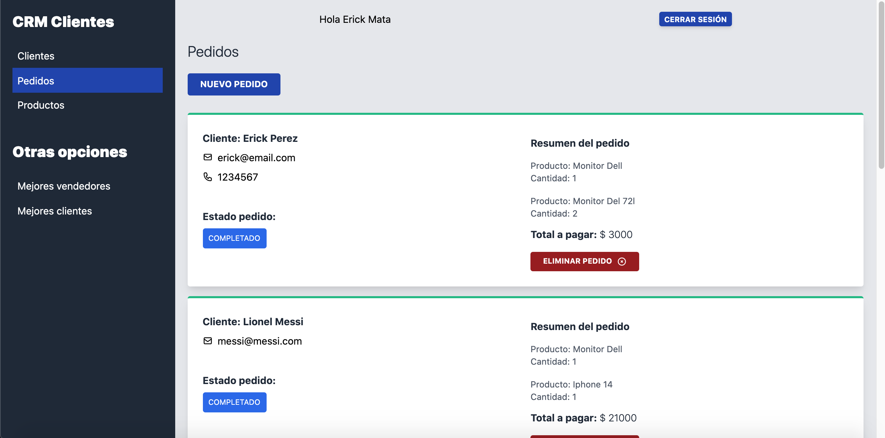
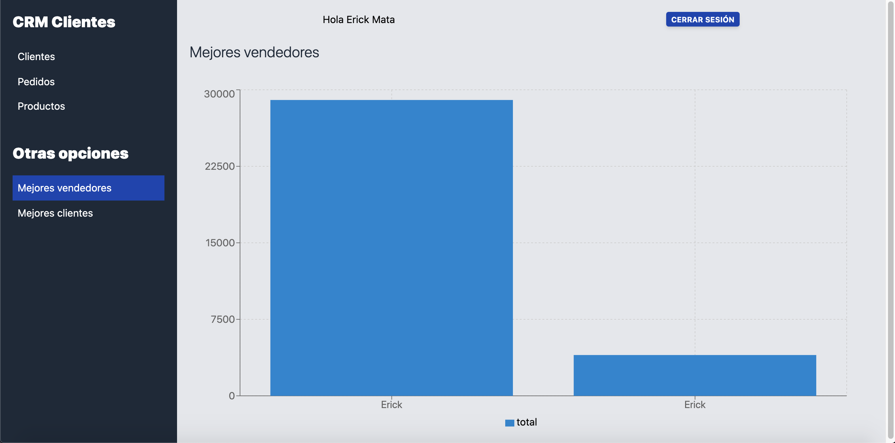

# 💻 CRM (frontend)

Este es un CRM en tiempo real para dar de alta vendedores, clientes, productos y pedidos. Se pueden ver gráficas en tiempo real de los mejores vendedores y clientes.




## 🛠 Scripts

```bash
# Instalar dependencias
$ npm install

# Encender servidor de desarrollo en localhost:3000
$ npm run dev

# Crear version de producción
$ npm run build && npm run export

```

## 💎 Tecnologías

- NextJS
- React Hooks
- TailwindCSS
- Apollo Client

## 💣 Despliegue

https://crmcliente-iota.vercel.app
